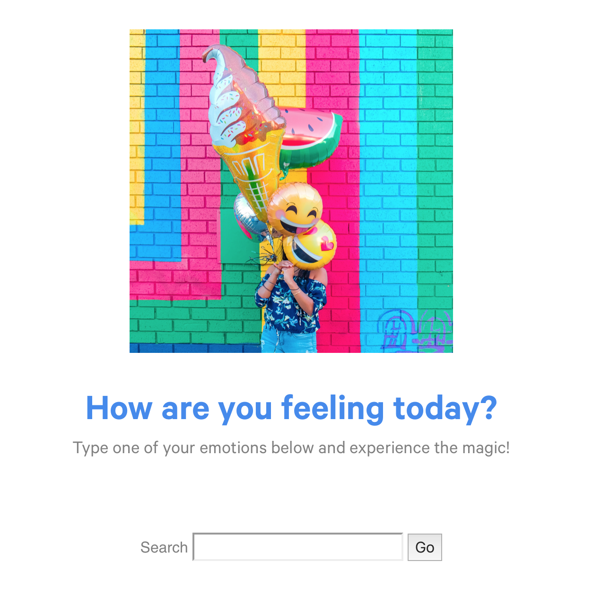

# TheEmotionSearchEngine
Final Project for the Cognitive Science 18 taught by Professor Shannon Ellis at UC San Diego. For my final project, I decided to create a system where users can type their emotion when prompted and the system returns a visual + musical expression based on the emotion.

